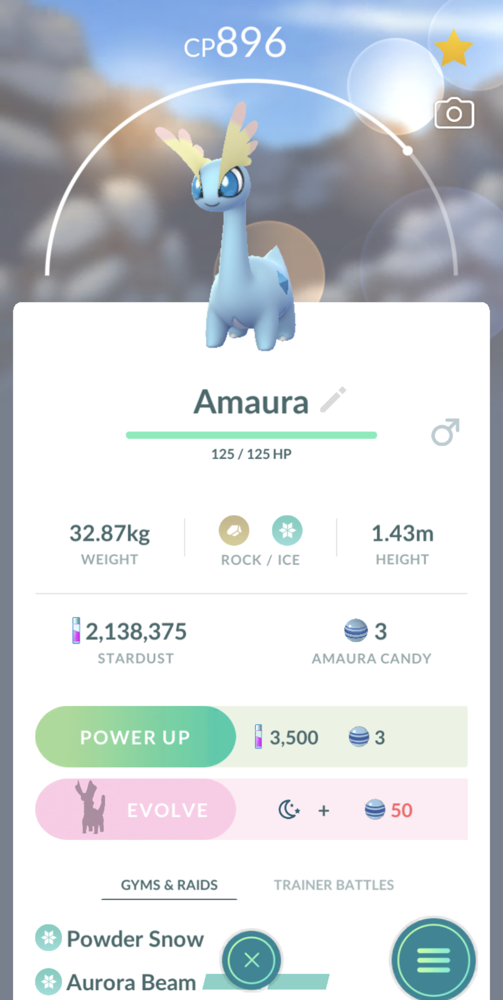

# ChatGPT-Sprint Capstone Project
This is a tool developed in Python that determines if a Pokemon is useful for battles and/or gyms, gives recommendations based on its stats.

The tool needs an screenshot from Pokemon Go of Pokemon's details.



It will return a JSON with the following format:

```JSON
{
  "name": "Amaura",
  "type": [
    "Rock",
    "Ice"
  ],
  "cp": 896,
  "hp": {
    "current": 125,
    "max": 125
  },
  "finalForm": false,
  "attacks": {
    "currentAttacks": [
      "Powder Snow",
      "Aurora Beam"
    ],
    "goodForGymsAndRaids": true,
    "goodForTrainerBattles": true,
    "bestMoveSet": [
      "Powder Snow",
      "Ancient Power"
    ],
    "pokemonTypesWeakTo": [
      "Steel",
      "Fighting",
      "Rock",
      "Water",
      "Grass"
    ],
    "pokemonTypesImmuneTo": [],
    "pokemonTypesStrongAgainst": [
      "Flying",
      "Ground",
      "Grass",
      "Dragon"
    ],
    "battleLeague": "Great League",
    "suggestedTeam": [
      {
        "name": "Amaura",
        "attacks": [
          "Powder Snow",
          "Ancient Power"
        ],
        "weakAgainstPokemonTypes": [
          "Steel",
          "Fighting",
          "Rock",
          "Water",
          "Grass"
        ],
        "strongAgainstPokemonTypes": [
          "Flying",
          "Ground",
          "Grass",
          "Dragon"
        ]
      },
      {
        "name": "Mudsdale",
        "attacks": [
          "Mud Slap",
          "Rock Slide"
        ],
        "weakAgainstPokemonTypes": [
          "Water",
          "Ice",
          "Grass"
        ],
        "strongAgainstPokemonTypes": [
          "Electric",
          "Rock",
          "Steel"
        ]
      },
      {
        "name": "Skarmory",
        "attacks": [
          "Air Slash",
          "Sky Attack"
        ],
        "weakAgainstPokemonTypes": [
          "Electric",
          "Fire"
        ],
        "strongAgainstPokemonTypes": [
          "Grass",
          "Fighting",
          "Bug"
        ]
      }
    ]
  }
}
```


## Requirements
Use the package manager [pip](https://pip.pypa.io/en/stable/) to install foobar.

```bash
pip install -r requirements. txt
```

## Usage
```bash
python src/main.py -i <image_path>
```
Where:
- image_path: an screenshot from Pokemon Go of Pokemon's detail.

